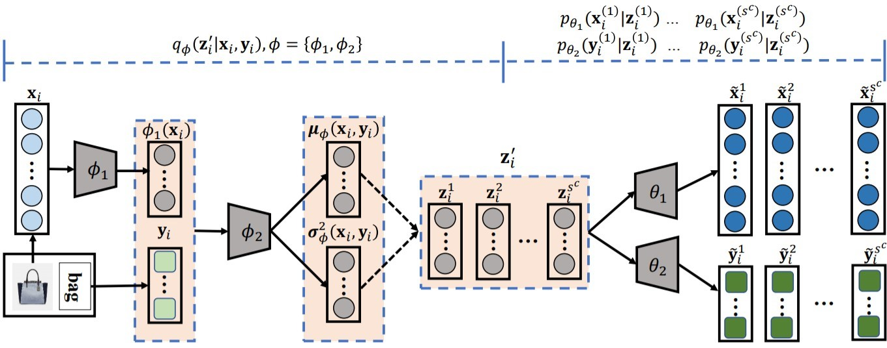

# Deep Generative Model for Robust Imbalance Classification
> Deep Generative Model for Robust Imbalance Classification
>
> Xinyue Wang, Yilin Lyu, Liping Jing

This is the official implementation of *DGC*.
## Abstract
Discovering hidden pattern from imbalanced data is
a critical issue in various real-world applications including computer vision. The existing classification
methods usually suffer from the limitation of data especially the minority classes, 
and result in unstable prediction and low performance. 
In this paper, a deep generative classifier is proposed to mitigate this issue via
both data perturbation and model perturbation. Specially, the proposed generative classifier is modeled by
a deep latent variable model where the latent variable
aims to capture the direct cause of target label. Meanwhile, 
the latent variable is represented by a probability distribution over possible values 
rather than a single fixed value, which is able to enforce uncertainty of
model and lead to stable prediction. Furthermore, this
latent variable, as a confounder, affects the process of
data (feature/label) generation, so that we can arrive
at well-justified sampling variability considerations in
statistics, and implement data perturbation. Extensive experiments have been conducted on widely-used
real imbalanced image datasets. By comparing with the
state-of-the-art methods, experimental results demonstrate the superiority of our proposed model 
on imbalance classification task.




## Requirement

The code was tested on:
- python=3.7
- tensorflow=1.14.0
- torchvision=0.4.1 (utilizd for dataset preparation)


## Usage
```
usage: python run.py [-h] [--exp EXP] [--seed SEED]

optional arguments:
  -h, --help   show this help message and exit
  --exp EXP    dataset [mnist/celeba]
  --seed SEED  random seed for imbalance data generation
```
The dataset will be automatically downloaded and prepared in `./data` when first run.

## License
MIT